# Optimizing Deep Learning Models: From CNN Quantization to Smol LLM

**A comprehensive initiative combining model quantization, few/zero-shot learning, and knowledge distillation to build efficient deep learning models**

---

## 🚀 Current Progress (Updated: 06/02/2025)

```mermaid
graph TD;
    A[Project Start] --> B[✔️ Environment Setup];
    B --> C[✔️ Baseline CNN];
    C --> D[✔️ FP16 Training];
    D --> E[✔️ QAT Implementation];
    E --> F[🔄 Few/Zero-Shot Learning];
    F --> G[❌ Knowledge Distillation];
    G --> H[❌ Smol LLM];
```

**Legend:**  
✔️ Completed | 🔄 In Progress | ❌ Pending

---

## 🧪 Experiment Notebooks

### QAT on MNIST
- **[Initial Implementation](QAT%20test%20NodeBooks/quantization-aware-training-qat-on-mnist-error.ipynb)**  
  Early QAT implementation with error analysis and debugging

- **[Stable Version](QAT%20test%20NodeBooks/quantization-aware-training-qat-on-mnist-v2.ipynb)**  
  Final working QAT implementation with proper quantization handling

---

## 📌 Key Improvements Implemented

1. **Quantization Stability**
   - Fixed tensor layout issues using `.reshape()`
   - Implemented proper QConfig handling
   - Added layer fusion validation

2. **Reproducibility**
   - Pinned library versions
   - Added seed initialization
   - Created standardized evaluation scripts

3. **Documentation**
   - Added detailed roadmap documents
   - Maintained error analysis notebooks
   - Structured repository for clarity

---

## 🎯 Next Steps

1. **Knowledge Distillation Pipeline**
   - [ ] Implement teacher-student framework
   - [ ] Design distillation loss function
   - [ ] Optimize temperature parameter

2. **Smol LLM Integration**
   - [ ] Adapt quantization techniques for transformers
   - [ ] Implement dynamic quantization
   - [ ] Benchmark on text classification

3. **Repository Improvements**
   - [ ] Add experiment tracking with Weights & Biases
   - [ ] Create standardized training scripts
   - [ ] Add CI/CD pipeline for testing

---

## 📚 Documentation & Resources

- [Project Roadmap](🚀%20Major%20Project%20Roadmap%20CNN%20Quantization%20&%20Smol%20LLM%20Integration.md)
- [QAT Implementation Guide](QAT%20test%20NodeBooks/quantization-aware-training-qat-on-mnist-v2.ipynb)
- [Base Papers](Base%20Paper/)

---

## 📜 License
This project is licensed under the MIT License - see the [LICENSE](LICENSE) file for details.

---

> **Note:** This README is dynamically updated as the project progresses. Last updated: 06/02/2025
