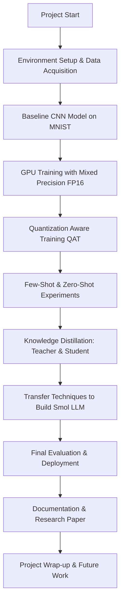

>  **Project Title:**  
> **Optimizing Deep Learning Models: From CNN Quantization with Advanced Techniques to a Lightweight LLM**

---
## 📅 Project Overview & Goals

- **Objective:**  
    Combine state-of-the-art deep learning techniques to optimize CNNs using Quantization Aware Training (QAT), integrate advanced learning paradigms (few-shot, zero-shot), apply knowledge distillation, and transfer these insights to build a compact language model (Smol LLM).
    
- **Key Goals:**
    - **Efficiency:** Reduce model size and inference latency.
    - **Robustness:** Enhance generalization using few-shot and zero-shot methods.
    - **Model Compression:** Use knowledge distillation to train lightweight models.
    - **Cross-Domain Transfer:** Leverage CNN quantization insights to optimize a small-scale LLM.
    
- **Outcome:**  
    A comprehensive research paper and a demo system that showcases optimized, deployable models with interactive visualizations, detailed documentation, and clear evaluation metrics.
    

---

## 🛠️ Environment & Setup

### 📦 Tools & Technologies

- **Programming Language:** Python 3.9+
- **Frameworks:** PyTorch, torchvision
- **Deep Learning Library:** PyTorch Lightning (for initial prototyping, later switching to native PyTorch for QAT)
- **Hardware:** NVIDIA GeForce RTX 3060 Ti (8GB VRAM) / cloud GPU's
- **Environment Manager:** Conda/Miniconda
- **Version Control:** Git (with a structured repository layout)
- **Documentation:** Obsidian for markdown notes, interactive diagrams, and research logs

### 🌟 Setup Checklist

- [ ]  **Install Conda/Miniconda**
- [ ]  **Create & activate a conda environment**
- [ ]  **Install GPU-enabled PyTorch & PyTorch Lightning**
- [ ]  **Install supporting libraries:** NumPy, matplotlib, scikit-learn, wandb
- [ ]  **Set up Jupyter Notebook (if needed) with the environment kernel**
- [ ]  **Configure Git repository with a clear project structure**

---

## 📊 Project Roadmap

---

## 📌 Detailed Building Process

### 1. **Environment Setup & Data Acquisition**

- **Goal:** Create a reproducible development environment.
- **Steps:**
    - Create a conda environment using Python 3.9.
    - Install GPU-enabled PyTorch and related libraries.
    - Download and preprocess the MNIST dataset (or CIFAR-10 for advanced experiments).
    
- **Visual:**
    - _Flowchart of Environment Setup_
        - [Conda Install → PyTorch Setup → Dataset Download

### 2. **Baseline CNN Development**

- **Goal:** Establish a robust baseline model for handwritten digit recognition.
- **Steps:**
    - Design a simple CNN architecture with convolutional, pooling, and fully connected layers.
    - Dynamically determine the flattened feature size using a dummy input.
    - Train and evaluate the model on the MNIST dataset.
- **Interactive Tip:**
    - Use Obsidian’s embedded diagrams to sketch your network architecture visually.
- **Diagram:**
    - **CNN Architecture Diagram:**
        - Input → Conv + ReLU → Pool → Conv + ReLU → Pool → Flatten → FC → Output

### 3. **GPU Training & Mixed Precision (FP16)**

- **Goal:** Leverage the RTX 3060 Ti for efficient training using FP16 precision.
- **Steps:**
    - Configure the training loop to use mixed precision with AMP (if applicable).
    - Monitor memory usage and adjust batch sizes as necessary.
- **Emoji Reminder:**
    - ⚡️ _"Faster training with mixed precision boosts your speed while reducing memory overhead!"_

### 4. **Quantization Aware Training (QAT) with PyTorch**

- **Goal:** Convert your model from FP32 to INT8 (or simulate low-precision arithmetic) to optimize inference.
- **Steps:**
    - Fuse appropriate layers (e.g., convolution + batch norm + ReLU).
    - Set up a QAT configuration (using the appropriate backend).
    - Train the model with fake quantization modules inserted.
    - Convert the QAT-trained model to a fully quantized model.
- **Diagram:**
    - **QAT Process Diagram:**
        - FP32 Model → [Layer Fusion] → [Prepare QAT] → Training → [Convert] → Quantized Model
- **Emoji Tip:**
    - 🎯 _"Aim for efficiency: The goal is to reduce model size without sacrificing accuracy!"_

### 5. **Few-Shot & Zero-Shot Learning Experiments**

- **Goal:** Assess model generalization with limited or unseen classes.
- **Steps:**
    - Create subsets of the dataset with limited samples per class (few-shot).
    - Exclude certain classes during training and test on them later (zero-shot).
- **Interactive Note:**
    - Use Obsidian’s inline tags (e.g., `#fewshot` and `#zeroshot`) to organize experimental notes.
- **Emoji:**
    - 🤏 _"Less data, more learning: Pushing the limits of generalization!"_

### 6. **Knowledge Distillation: Teacher & Student Models**

- **Goal:** Transfer knowledge from a high-capacity (teacher) model to a lightweight (student) model.
- **Steps:**
    - Train a powerful teacher model (e.g., a larger CNN).
    - Set up a student model (a smaller or quantized version).
    - Define a combined loss (e.g., cross-entropy + KL divergence) for distillation.
    - Train the student using the teacher’s softened outputs.
- **Emoji & Tip:**
    - 🧠 _"Let the master teach the apprentice: Distillation can significantly boost performance in smaller models."_

### 7. **Transferring Techniques to Build a Smol LLM**

- **Goal:** Apply the quantization and optimization insights from the CNN experiments to a simple language model.
- **Steps:**
    - Design a lightweight LLM architecture (e.g., using LSTM or a small Transformer).
    - Apply FP16 training or quantization techniques similar to the CNN pipeline.
    - Evaluate the LLM’s performance on a relevant text classification or language modeling task.
- **Interactive Idea:**
    - Embed interactive graphs comparing model size, inference speed, and accuracy between the CNN and LLM models.
- **Emoji:**
    - 📝 _"Small but mighty: Optimizing our language model for speed and efficiency."_

### 8. **Final Evaluation, Deployment, & Documentation**

- **Goal:** Validate the performance improvements and prepare the final deliverables.
- **Steps:**
    - Evaluate each model version (baseline, quantized, distilled, and LLM) using standardized metrics.
    - Save and deploy models using TorchScript or ONNX for real-world inference.
    - Document every experiment in detail, including interactive notes and graphs.
- **Graph Ideas:**
    - Accuracy vs. Model Size
    - Inference Latency vs. Quantization Level
- **Emoji & Note:**
    - 📊 _"Data speaks: Use visualizations to clearly show the improvements and trade-offs."_

---

## 🔗 Additional Resources & References

- **PyTorch Quantization Documentation:**  
    Explore the [official docs](https://pytorch.org/docs/stable/quantization.html) for detailed guidance on QAT and INT8 quantization.
- **Research Papers:**
    - “Quantization and Training of Neural Networks for Efficient Integer-Arithmetic-Only Inference”
    - “Distilling the Knowledge in a Neural Network”
- **Community Forums:**
    - [PyTorch Forums](https://discuss.pytorch.org/) for troubleshooting and advanced tips.
- **Interactive Tools:**
    - Use [Mermaid Live Editor](https://mermaid.live/) to edit and visualize diagrams.
    - Use [Excalidraw](https://excalidraw.com/) for hand-drawn style sketches.
